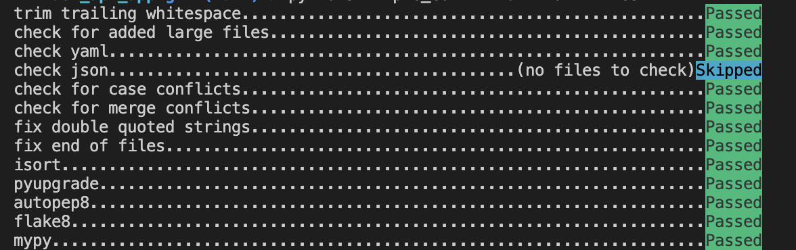
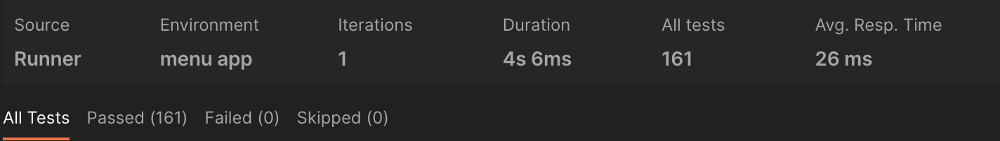

Проект на FastAPI с использованием PostgreSQL в качестве БД. В проекте реализованы REST API для работы с меню ресторана, все CRUD операции асинхронные. \
Есть возможность добавлять сущности в БД через файл XLSX, находящийся в папке 'admin'. \
Для кэширования ответов пользователю используется Redis. Инвалидация кэша затрагивает только необходимые сущности, а не полностью затирает кэш. \
Для отслеживания изменений в файле XLSX используется Celery и RabbitMQ в качестве брокера. Изменения проверяются каждые 15 секунд. \

Запуск приложения

Для запуска приложения - "docker-compose -f docker-compose.yaml up -d" \

Для остановки приложения - "docker-compose stop" \
Для запуска тестов - "docker-compose -f docker-compose-test.yaml up" \

Все линтеры \
 \
Postman \

 Допы \
 Дз 2 \
 - Реализовать вывод количества подменю и блюд для Меню через один (сложный) ORM запрос. \
 Находится в menu_repository.py, функция _get_menu \
 - Реализовать тестовый сценарий «Проверка кол-ва блюд и подменю в меню» из Postman с помощью pytest \
 Файл test_dish_count.py в папке tests

 Дз 3 \
- Описать ручки API в соответствий c OpenAP \
Файл openapi.json лежит в корне проекта \
-  Реализовать в тестах аналог Django reverse() для FastAPI \
Функция лежит в файле app/main.py и использованна во всех тестах\
